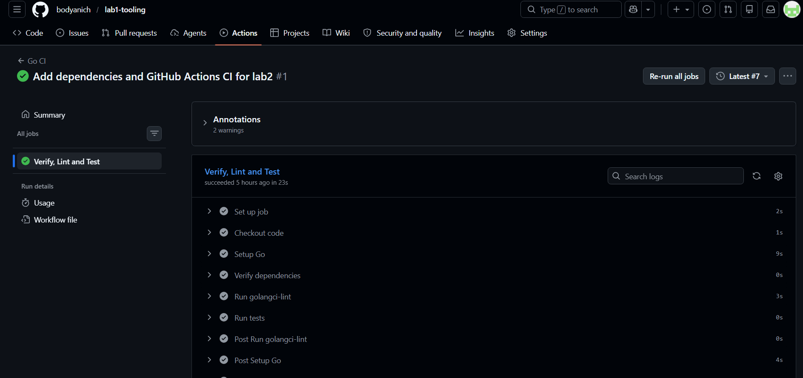

# Звіт до лабораторної роботи №2

## Тема

**Управління залежностями в Go та автоматизація перевірок через GitHub Actions**

## Мета роботи

Метою лабораторної роботи є опанування керування зовнішніми залежностями у Go за допомогою Go Modules, аналіз роботи механізму Minimal Version Selection, а також налаштування конвеєра безперервної інтеграції через GitHub Actions. У межах роботи було додано зовнішні бібліотеки для логування та читання конфігурації, оновлено `go.mod` і `go.sum`, налаштовано перевірку залежностей, лінтинг і тестування у CI.

## Використане програмне забезпечення

- Go SDK версії 1.21 або новішої;
- Visual Studio Code;
- Git;
- GitHub;
- GitHub Actions;
- `golangci-lint`;
- `make`;
- Go Modules.

## Структура проєкту

```text
lab1-tooling/
├── .github/
│   └── workflows/
│       └── ci.yml
├── cmd/
│   └── app/
│       └── main.go
├── internal/
│   ├── config/
│   │   └── config.go
│   ├── logger/
│   │   └── logger.go
│   ├── calculator.go
│   └── calculator_test.go
├── bin/
├── .gitignore
├── .golangci.yml
├── Makefile
├── README.md
├── config.yaml
├── go.mod
└── go.sum
```


## Хід виконання роботи

### 1. Додавання зовнішніх залежностей

Для логування було обрано бібліотеку `go.uber.org/zap`, а для роботи з конфігураціями — `github.com/spf13/viper`.

Команди:

```powershell
go get go.uber.org/zap
go get github.com/spf13/viper
```

Після цього у файлі `go.mod` з’явилися нові залежності, а у файлі `go.sum` — контрольні суми завантажених модулів.

### 2. Створення конфігураційного файлу

Було створено файл `config.yaml`:

```yaml
app:
  name: "Lab 2 Go Tooling"
  version: "1.0.0"
  environment: "development"

server:
  host: "localhost"
  port: 8080
```

### 3. Реалізація читання конфігурації

Було створено пакет `internal/config`, у якому описано структури `AppConfig`, `AppSettings`, `ServerSettings` та функцію `Load`. Функція читає дані з `config.yaml` за допомогою бібліотеки `viper`.

### 4. Реалізація логера

Було створено пакет `internal/logger` із функцією `New`, яка створює logger залежно від середовища виконання:

```go
func New(environment string) (*zap.Logger, error) {
	if environment == "production" {
		return zap.NewProduction()
	}
	return zap.NewDevelopment()
}
```

### 5. Інтеграція конфігурації та логування в `main.go`

У `cmd/app/main.go` було додано завантаження конфігурації та ініціалізацію логера.

Команда запуску:

```powershell
go run ./cmd/app
```

### 6. Очищення залежностей через `go mod tidy`

Після додавання бібліотек було виконано:

```powershell
go mod tidy
```

Команда оновлює `go.mod` і `go.sum`, додаючи потрібні залежності та видаляючи невикористані.

### 7. Перевірка залежностей

Для перевірки цілісності модулів було використано:

```powershell
go mod verify
```

Очікуваний результат:

```text
all modules verified
```

### 8. Оновлення Makefile

У `Makefile` було додано ціль:

```makefile
verify:
	go mod verify
```

Також оновлено ціль `all`:

```makefile
all: fmt verify lint test build
```

Команда повної перевірки:

```powershell
make all
```

### 9. Налаштування GitHub Actions

Було створено файл `.github/workflows/ci.yml`. Workflow запускається при кожному `push` або `pull_request` у гілку `main`.

Основні кроки CI:

1. Checkout code;
2. Setup Go;
3. Verify dependencies;
4. Run golangci-lint;
5. Run tests.

### 10. Перевірка роботи GitHub Actions

Після push змін на GitHub workflow автоматично запускається. Успішне проходження підтверджується зеленою галочкою.





### 11. Додавання статус-бейджа в README

У файл `README.md` було додано бейдж статусу GitHub Actions

### 12. Оновлення залежності до конкретної версії

Для демонстрації роботи з версіями модулів було виконано:

```powershell
go list -m -versions go.uber.org/zap
go get go.uber.org/zap@v1.27.0
go mod tidy
```

Після цього було перевірено зміни у `go.mod`.

## Результати виконання

У результаті виконання лабораторної роботи було додано залежності `zap` і `viper`, реалізовано читання конфігурації, додано логування, оновлено `go.mod` і `go.sum`, налаштовано `go mod verify`, оновлено `Makefile`, створено GitHub Actions workflow і додано status badge у README.

## Висновок

У межах лабораторної роботи було розглянуто практичне керування залежностями у Go-проєкті та налаштування автоматичних перевірок через GitHub Actions. Go Modules дозволяють явно фіксувати залежності, контролювати їхні версії та перевіряти цілісність через `go.sum`. CI забезпечує автоматичну перевірку коду після кожної зміни.

## Контрольні питання

### 1. Як Go вирішує, яку версію бібліотеки обрати, якщо два модулі потребують різні версії?

Go використовує Minimal Version Selection. Якщо різні залежності потребують різні версії одного модуля, Go обирає мінімальну версію, яка задовольняє всі вимоги.

### 2. Що означають цифри у версії `v1.2.3`?

`v1.2.3` означає major, minor і patch version. Major може ламати сумісність, minor додає функціональність без ламання сумісності, patch виправляє помилки.

### 3. Чому деякі модулі в `go.mod` мають коментар `// indirect`?

`// indirect` означає, що модуль не імпортується напряму кодом проєкту, але потрібен одній із прямих залежностей.

### 4. Чому важливо запускати лінтер саме в CI?

CI запускає перевірки автоматично для кожного push або pull request, тому якість коду перевіряється незалежно від локального середовища розробника.

### 5. Яку роль відіграє `go.sum` у захисті від supply chain attacks?

`go.sum` містить контрольні суми залежностей. Це допомагає виявити підміну або неочікувану зміну залежності.
